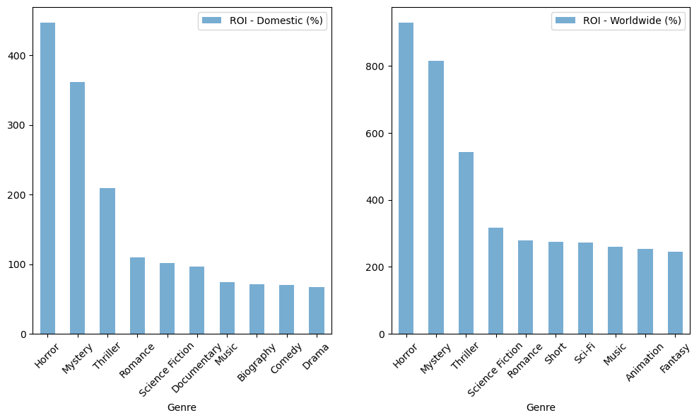
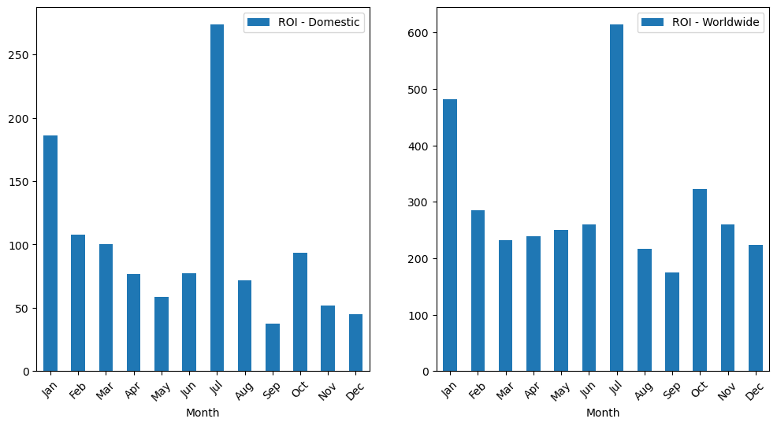
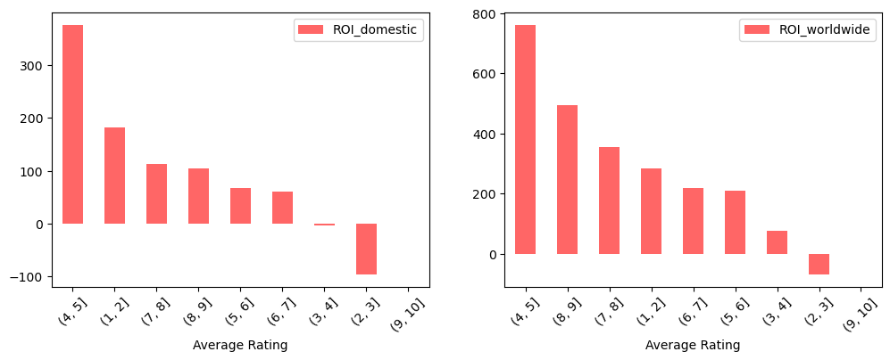

# What movies are performing best at the box office?

## 1. Overview
A company has decided to create a new movie studio. They would like to explore what types of films are currently doing the best at the box office. 

## 2. Business Understanding
### 1.1. Business Objective 
This project aims to determine which movies are currently doing the best at the box office. Several sources of data are used (see [here](https://github.com/setare92-ha/project_eda_movie_profit_analysis/tree/main/zippedData)). These sources include data from [Box Office Mojo](https://www.boxofficemojo.com/), [IMDB](https://www.imdb.com/?ref_=nv_home), [Rotton Tomatoes](https://www.rottentomatoes.com/), [The Movie DataBase](https://www.themoviedb.org/?language=en-US)(TMDB) and [TheNumbers](https://www.the-numbers.com/). The study and its findings will serve stakeholders trying to start a new venture in the movie industry, such as creating a movie studio, or streaming platforms trying to determine movies that would be profitable additions to their collection. 

### 1.2. Background Information
Different metrics may be used to determine the success or profitability of a movie. We may come to different conclusions based on the choice of metric (see [this article](https://www.hollywoodreporter.com/movies/movie-news/what-is-profitable-movie-ever-1269879/) for reference). Here, we choose Return On Investment (ROI) as an appropriate metric to use. ROI may be defined as $$ROI=\frac{Revenue-Expense}{Expense}\times 100$$ We focus on this fiscal metric to determine the most profitable movies. Later, we will focus on the different aspects of a movie (genre, movie ratings, director, etc.) that may correlate to the movie's success in general.  
## 3. Data Understanding and Analysis

## 4. Recommendations
1. Movies yielding the highest profit belong to the *horror*, *mystery* and *thriller* genres. For medium budget movies (budget between 7 to 51 million dollars), the documentary and musical genre also seem prominent in terms of revenue generation. 

**Figure 1.** Domestic and worldwide Return On Investment (ROI) of movies based on Genres. The highest profitable movies belong to the *mystery*, *horror* and *thriller* genres. 

2. It is recommended that the movie is released in July. If not in summer, it is recommended that the movie is released in the month of January since the results show high profits for movie releases in these months.

**Figure 2.** Domestic and worldwide Return On Investment (ROI) of movies based on the month of year the movie is released. Highly profitable movies were released in *July*, followed by *January*.

3. If the production budget is low or medium, it is recommended that it'd be kept to a minimum since the correlation coefficients for ROI and production budget are negative for these categories. However, for high-budget movies, it is recommended that use moderately higher numbers (to advertise the movie, etc.) since the correlation coefficients seem to suggest a positive effect between profitability and production budget.

4. Highly acclaimed/rated movies do not necessarily correlate with high profits. It is recommended that stakeholders stick with average-rated movies.

**Figure 3.** Domestic and worldwide Return On Investment (ROI) of movies based on audience average rating aggregated from IMDB and TMDB datasets. Highly profitable movies are not necessarily highly acclaimed/rated. 

**Please note that imbalance exists among the number of data points in each bin. The analysis would benefit from additional data points in bins associated with extremely low or extremely high rankings. For more, see the Jupyter notebook.* 

## 5. Limitations and Next Steps
The following can be listed as the limitations of the following study:
- In the data cleaning stage, we did our best to keep the highest percentage of data possible while gathering information on movie genres, average ratings, production budget, and domestic/worldwide gross. As explained earlier, retreiving this information involved computationally demanding steps. It may be possible to optimize the search and match algorithms (for example using fuzzy matching techniques) to both improve performance and make our dataset even bigger using data from Box Office Mojo, for example. With the current techniques used in this work, that would have been time prohibitive.
- Our analysis of the production budget showed that the trends can indeed be different for low budget, medium budget and high budget movies. Since production budget is a factor stakeholders have control over, it would be beneficial to do a more in-depth analysis on the key factors contributing to the success of movies in each category. This will help stakeholders focus on those key driving factors depending on the budget at hand.
- The current work does not present a model that can describe return on investment as a function of factors such as genre, average rating, etc. It would be beneficial to build statistically significant linear regression models that could better explain the evolution of ROI with these factors. This would require treating the categorical variables (e.g. genre) and is beyond the scope of the current work.    